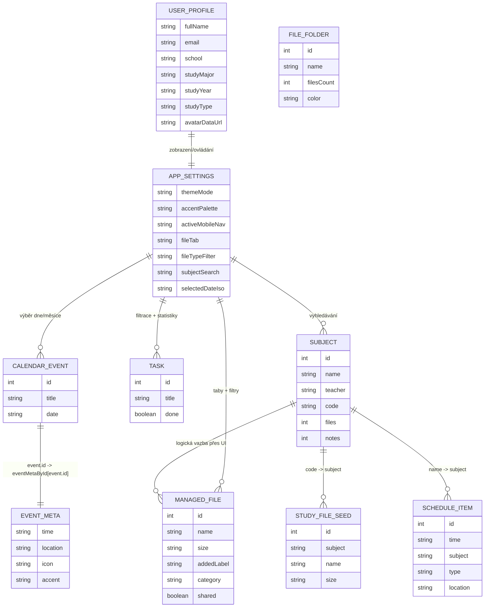
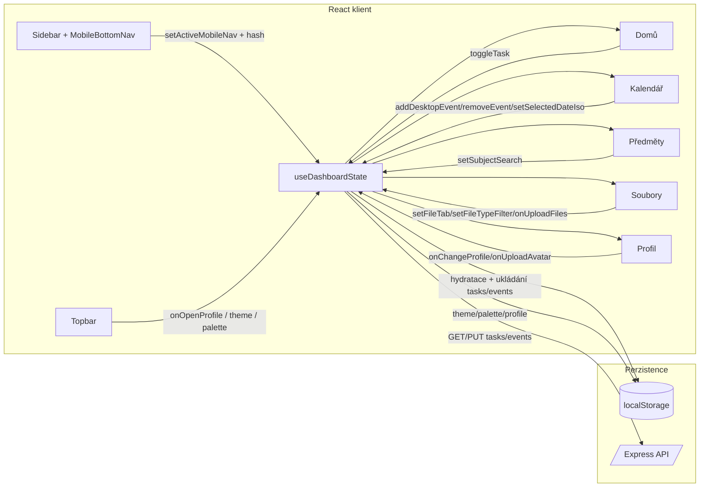
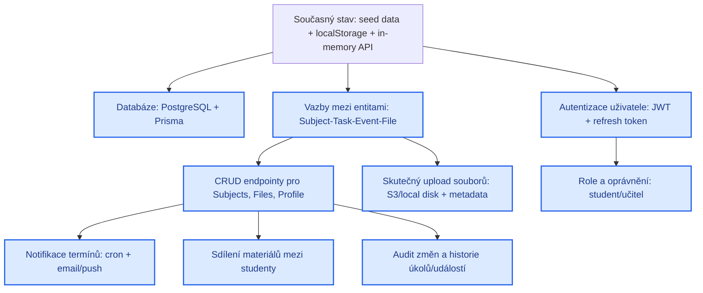

# PB138 – ERD a interakce aplikace (aktuální stav + návrhy)

## 1) ERD aktuálního stavu (data model)

## 2) Jak mezisebou interagují záložky a funkce

## 3) Návrhy budoucích úprav (modře)

### Co je dnes implementováno vs. co je návrh
- **Implementováno nyní:** správa úkolů, kalendáře, souborů a profilu v klientovi; synchronizace `tasks/events` s `/api/tasks` a `/api/events`; `theme/palette/profile` v `localStorage`.
- <strong>Návrh (modře):</strong> relační DB, autentizace, plné CRUD API, reálný upload, notifikace, sdílení, historie změn a role.
