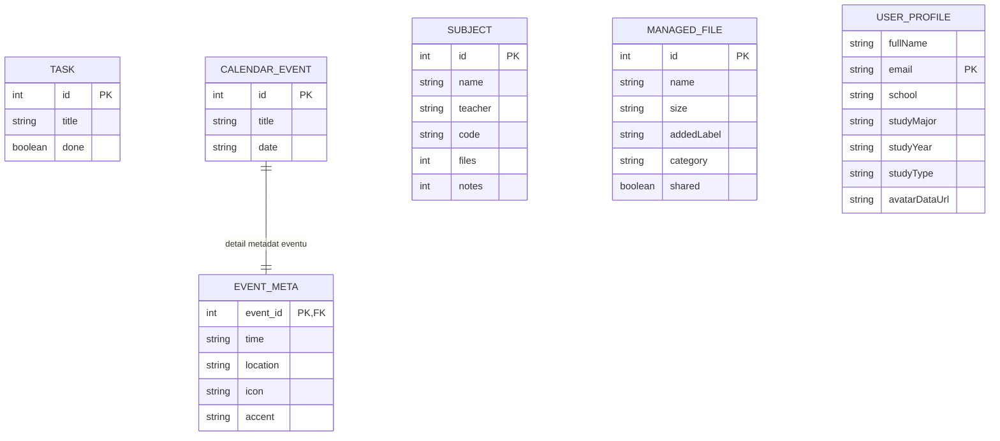

# PB138 — ERD aktuálního stavu + návrh rozšíření

Níže je ERD podle **aktuálního stavu kódu** (frontend typy + backend API), a pod tím návrh budoucího cílového modelu.

## 1) Aktuální stav (as-is)



Poznámka: v aktuální implementaci jsou `TASK` a `CALENDAR_EVENT` persistovány backendem, zatímco `SUBJECT`, `MANAGED_FILE` a `USER_PROFILE` jsou primárně řízené frontend stavem (seed/local state).

## 2) Budoucí návrh (to-be, modře)

```mermaid
erDiagram
    SUBJECT {
        int id PK
        string code
        string name
        string teacher
        datetime createdAt
        datetime updatedAt
    }

    TASK {
        int id PK
        int subjectId FK
        string title
        boolean done
        datetime dueAt
        datetime createdAt
        datetime updatedAt
    }

    CALENDAR_EVENT {
        int id PK
        int subjectId FK
        string title
        date date
        string time
        string location
        datetime createdAt
        datetime updatedAt
    }

    FILE_RECORD {
        int id PK
        int subjectId FK
        string name
        string mimeType
        bigint sizeBytes
        boolean shared
        string pathOrUrl
        datetime createdAt
        datetime updatedAt
    }

    USER_PROFILE {
        int id PK
        string fullName
        string email UNIQUE
        string school
        string studyMajor
        string studyYear
        string studyType
        string avatarUrl
        datetime createdAt
        datetime updatedAt
    }

    AUDIT_LOG {
        int id PK
        int subjectId FK
        string entityType
        int entityId
        string action
        json beforeData
        json afterData
        datetime createdAt
    }

    USER_PROFILE ||--o{ SUBJECT : "owner"
    SUBJECT ||--o{ TASK : "contains"
    SUBJECT ||--o{ CALENDAR_EVENT : "plans"
    SUBJECT ||--o{ FILE_RECORD : "materials"
    SUBJECT ||--o{ AUDIT_LOG : "history scope"

    classDef future fill:#dbeafe,stroke:#2563eb,color:#1e3a8a,stroke-width:2px
    class SUBJECT,TASK,CALENDAR_EVENT,FILE_RECORD,USER_PROFILE,AUDIT_LOG future
```

## 3) Vztahy mezi záložkami/funkcemi (logická mapa)

- **Home**: čte agregace z `TASK`, `CALENDAR_EVENT`, `SUBJECT`, `MANAGED_FILE`.
- **Calendar**: CRUD nad `CALENDAR_EVENT` + detailní metadata v `EVENT_META`.
- **Subjects**: katalog `SUBJECT`; v cílovém modelu parent pro tasky, eventy a soubory.
- **Files**: práce nad `MANAGED_FILE`; v cílovém modelu přechod na `FILE_RECORD` navázaný na `SUBJECT`.
- **Profile**: úprava singletonu `USER_PROFILE`.
- **History/Audit (návrh)**: `AUDIT_LOG` zachycuje CREATE/UPDATE/DELETE napříč entitami v kontextu subjectu.
